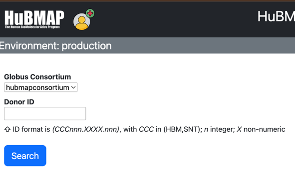
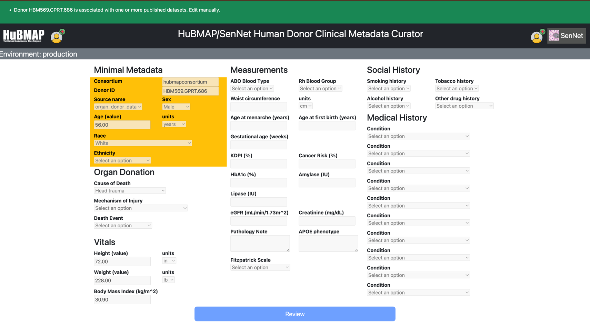
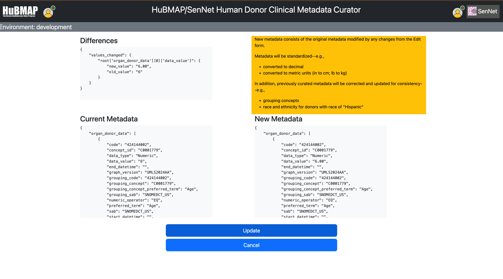
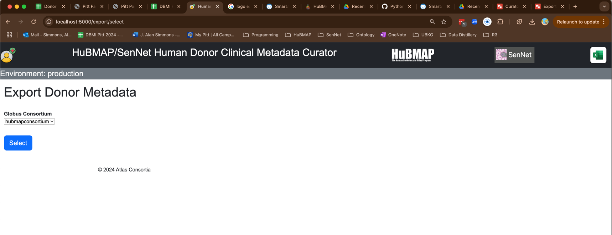

# HuBMAP/SenNet Human Donor Clinical Metadata Curator application


# Background
## Donor clinical metadata
When registering datasets generated from tissue samples collected from human donors, providers such as HuBMAP Tissue Mapping Centers (TMCs) include
clinical information about donors. Clinical information on a donor varies in detail and
scope, ranging from a spreadsheet row with a few curated elements to scans of UNOS forms that 
accompany an organ donation.

In general, clinical information is both unstructured and considered Patient Health Information (PHI) per 
HIPAA. The University of Pittsburgh, acting as a HIPAA Honest Broker, curates
clinical information, creating metadata data that are:
1. de-identified
2. _encoded_, or associated with codes from standard biomedical vocabularies such as SNOMEDCT and NCI.

Up to now, curation has been manual: the curator manually encodes information from source files into
a data entry spreadsheet, following [this process](https://docs.google.com/document/d/1ILlkcaD0wo3CGz7ceh5ikjHQA-2owOfmQRR9CgAkcl4/edit#heading=h.p81z9ilnkp3o). The spreadsheet becomes the input source for a script that inserts
donor clinical metadata into the associated dataset record in the provenance database.

Manual curation is both tedious and prone to error. Curation can be automated.

## Valuesets
Clinical metadata of interest is one of three types:
1. Numeric (e.g., lab values, measurements such as height)
2. Categorical (e.g., Cause of Death, blood type)
3. Free text

Each type of metadata can be associated with discrete codes. 
Codes that describe a particular type of data are collected into valuesets and 
maintained in an online _Valuset Manager_ spreadsheet. 

Categorical metadata may be organized in the Valueset Manager in one of two ways:
1. in a dedicated tab in the spreadsheet (e.g., Race)
2. as a set of rows in a tab (e.g., ABO blood types in the Blood Type tab)

We have few expectations regarding the form of 
clinical data from providers beyond the minimum set required to build a DOI for a dataset:
* race
* sex
* age
* whether from an organ donor or a living donor 

Clinical data from a provider often contains novel information--e.g., 
previously undocumented medical history conditions or measurements. 

In general, it is necessary to update the Valueset Manager spreadsheet for every set of donors. 

# Solution
The curation solution features:
- A user interface that allows
   - data entry--e.g., selection of categorical values or entry of numeric or text values
   - validation--e.g., data type and range
   - multiple entries for patient medical history
- Encoding of each metadata element to appropriate valuesets
- Form content driven by the valueset spreadsheet to allow rapid changes in valuesets
- Ability to update a neo4j provenance database with structured clinical metadata for a donor

# Solution Architecture
## User Interface
The curator is a Python Web application involving:

| tool                                                                            | purpose                                                     |
|---------------------------------------------------------------------------------|-------------------------------------------------------------|
| Python                                                                          | application function                                        |
| [Flask](https://flask.palletsprojects.com/en/3.0.x/)                            | Python web framework                                        |
| [Flask Blueprints](https://flask.palletsprojects.com/en/3.0.x/blueprints/)      | modular Flask applications                                  |
| [WTForms](https://wtforms.readthedocs.io/en/2.3.x/forms/)                       | forms in Flask applications                                 |
| [Jinja](https://jinja.palletsprojects.com/en/3.1.x/)                            | Web page templating                                         |
| Javascript                                                                      | Event handling and UI features (including a spinner control) |
| [Bootstrap](https://getbootstrap.com/)                                          | UI toolkit                                                  |
| [HuBMAP entity-api](https://smart-api.info/ui/0065e419668f3336a40d1f5ab89c6ba3) | Reads/updates donor metadata in HuBMAP provenance           |
| [SenNet entity-api](https://smart-api.info/ui/7d838c9dee0caa2f8fe57173282c5812) | Reads/updates source metadata in SenNet provenance     |


## Configuration
The application uses **app.cfg** to obtain:
- consortium options (HuBMAP or SenNet)
- environment option (dev or production)
- entity-api environment (e.g., development or production)
- URI for the Valueset Manager Google sheet
- Globus client keys and secrets for HuBMAP and SenNet

The configuration file must be kept separate from the application in either of its possible deployments:
1. In a "bare-metal" deployment, in which the application is run from within a clone of the GitHub repository, the configuration file must not be in the repo. the application looks for the app.cfg file in a subfolder of the user root
named **donor-metadata**.
2. In a "containerized" deployment, in which the application is executed from within a Docker container, the configuration file must not be in the container. the application looks for the app.cfg file in the /usr/src/app/instance
folder, which is bound to a volume on the host machine.

## Databases
The application works with three databases:
1. the Valueset Manager, a Google Sheets document
2. the neo4j provenance databases for the two consortia, abstracted by consortium-specific instances of entity-api.

## Workflows

There are two workflows in the application:
1. A **curation workflow** that allows for editing of the metadata for a single donor in a consortium.
2. An **export workflow** that exports metadata for all donors in a consortium to a CSV file.

### Curation workflow


#### app
The application:
1. uses the **valuesetmanager** helper class to read from the Valueset Manager spreadsheet
2. manages the Flask session
3. registers Flask Blueprints
4. customizes HTTP error handling, routing to **401.html** and **404.html**.

#### Home page
1. The Home HTML page **index.html** includes a form that allows the user to specify 
   * consortium (HuBMAP or SenNet)
   * Donor ID
2. The WTForm **globusform.py** populates the home page **index.html** with information from the **app.cfg** file.
3. The Blueprint routes */* and */login*:
   * authenticates the user in the appropriate Globus context
   * works with the **donor** helper class to verify that the donor is in provenance
   * redirects either to the Edit page or the custom 404 page


#### Edit page
1. The Edit page **edit.html** includes a form that allows metadata data entry.
2. The WTForm **editform.py**:
   * works with the **valuesetmanager** helper class to obtain valueset content
   * populates the form in **edit.html**, including content of categorical lists
3. The Blueprint route */edit*:
   * works with the **donor** helper class to obtain current donor metadata from provenance
   * populates the form in **edit.html** with current metadata values
   * translates form data into a revised metadata JSON that conforms to the donor metadata schema in provenance.
   * sets defaults for required metadata--e.g., if no race is specified, sets the race to Unknown
   * converts linear and weight measurements to metric units
   * compares current and revised metadata JSON for the donor
   * posts JSONs for current metadata, revised metadata, and comparison to **review.html**


#### Review page
1. The Review page **review.html** displays:
   * the current metadata JSON for the donor
   * the new metadata JSON for the donor
   * the comparison of the current and new metadata JSONs
2. The Blueprint route */review*:
   * works with the **donor** helper class to update the donor metadata in provenance
   * redirects to **index.html**


### Export workflow


#### Export select page
The page allows the user to select a consortium for which donor metadata should be exported.


#### Export review page
The page displays in spreadsheet format the metadata for human donors in the consortium provenance.


The **Export** button downloads a file named *consortium*_metadata.csv.

### 400 page
The **400.html** page is a custom 400 error page

### 401 page
The **401.html** page is a custom 401 error page that explains potential causes and solutions for authentication errors.

### 403 page
The **403.html** page is a custom 403 error page.

### 404 page
The **404.html** page is a custom 404 error page. The 404 error in this case is "donor not found", not "file not found".

### base.html
All HTML files in the application inherit from **base.html**, which includes:
* a navbar
* a message panel that displays Flask flash messages
* a spinner control to animate waiting in the search form

### _formhelpers.html
This file contains a custom Jinja script used to populate content from WTForms forms in a HTML page.

### Helper classes

| name            | role                                           | uses       |
|-----------------|------------------------------------------------|------------|
| appconfig       | reads from the app.cfg                         |            |
| valuesetmanager | reads from the Valueset Manager spreadsheet    |            |
| entity          | reads from and writes to a provenance database | entity-api |
| donor           | represents donor metadata                      | entity     |
| DonorUI         | encapsulates the Flask app                     | app        |
| searchAPI       | reads from a provenance database               | search-api |


# Business rules
1. The application can only update metadata for an existing donor; it does not create donor entities in provenance.
2. The application will not update metadata for a donor that is associated with published datasets. 
2. The application can document a maximum of 10 medical conditions. The application cannot update metadata for a donor if the current metadata includes more than 10 conditions.
3. The application will only update metadata if there was a change.
4. In SenNet, the application will only update donors that are human sources.
5. The application attempts to standardize on units (e.g., *in* and *cm* for height). If an existing unit is unexpected, the application will require manual intervention.

# Authentication token
The entity-api requires an authentication token, which is obtained from Globus.
An authentication token for a consortium's entity-api is set via the consortium's Single Sign On.

## 401 (Access denied) errors
The application will raise a HTTP 401 exception when:
1. The authentication token expires at the consortium level.
2. The authentication token is for the incorrect consortium--e.g., if the user provides a HuBMAP token for an update to a donor in SenNet.

# Potential issues
## Non-compliant current data
Donors already containing metadata may diverge from the current schema. This is especially the case for
donors in HuBMAP who were registered prior to the implementation of valuesets.

Examples of divergence include: 
1. Some early donors have a race of "Hispanic". The current practice is to code "Hispanic" as an ethnicity.
2. Grouping concepts for some categorical metadata may have changed.

Donors with metadata that does not comply with the current schema may cause issues in the Edit form. 
For example, if the value for a categorical metadata element is not in the current valueset associated 
with the metadata element, the Edit form will raise a validation error.

## Units
Units are currently not encoded in metadata, but stored as free text. 
This has resulted in variance in units--i.e., different spellings or case.
Because the Edit form emulates encoding of metadata using a list (e.g., only "in" and "cm" for height), there will be 
validation errors for measurements with variant units (e.g., "inches").

# Deployments 
The application can run in one of three types of deployment:
1. In a "bare-metal" deployment, running on a local machine.
2. As a containerized application running from a local Docker image.
3. As a containerized application running from an image pulled from Docker Hub.

## Build app.cfg
1. Copy **app.cfg.example** to a file named **app.cfg**.
2. Edit the value of the ENDPOINT_BASE key to point to the desired instance of entity-api.
3. Generate a value for the Flask application (KEY). The preferred method from the Flask documentation is to run ```python -c 'import secrets; print(secrets.token_hex())'```
4. Provide values for the following Globus authentication parameters:
   * GLOBUS_HUBMAP_CLIENT
   * GLOBUS_HUBMAP_SECRET
   * GLOBUS_SENNET_CLIENT
   * GLOBUS_SENNET_SECRET
   
   Obtain these parameters from the Globus administrator.

## Docker
Install [Docker](https://docs.docker.com/engine/install/) on the local machine.

## Bare-metal deployment
1. Copy **app.cfg** to a subfolder of the user root (~) named *donor-metadata*.
2. ```python app.py```

### Local Docker deployment
1. Copy **app.cfg** to the same folder that contains the **run_local.sh** script.
2. Execute **build_local.sh** to create a Docker image named **hmsn/donor-data-local**.
2. Execute **run_local.sh** to create a Docker container named **donor-data**.

### Docker Hub deployment
1. Copy **app.cfg** to the same folder that contains the **run_hub.sh** script. 
2. Execute **build_hub.sh** to create a Docker image named **hmsn/donor-data**. 
3. Execute **run_hub.sh** to create a Docker container named **hmsn/donor-data**.

The containerized application is mapped to the URL http://127.0.0.1:5000 on the local machine.
The **run_*.sh** scripts open the default browser to the URL.

### Docker Compose
1. Copy **app.cfg** to the same folder that contains the **compose-run.sh** script.
2. Execute **compose-run.sh** to create a Docker Compose container.

## Hub Distribution Zip
Create a Zip archive containing:
1. **app.cfg**
2. **run_hub.sh**

This archive contains the minimal set of files needed to install the application on a local machine running Docker.